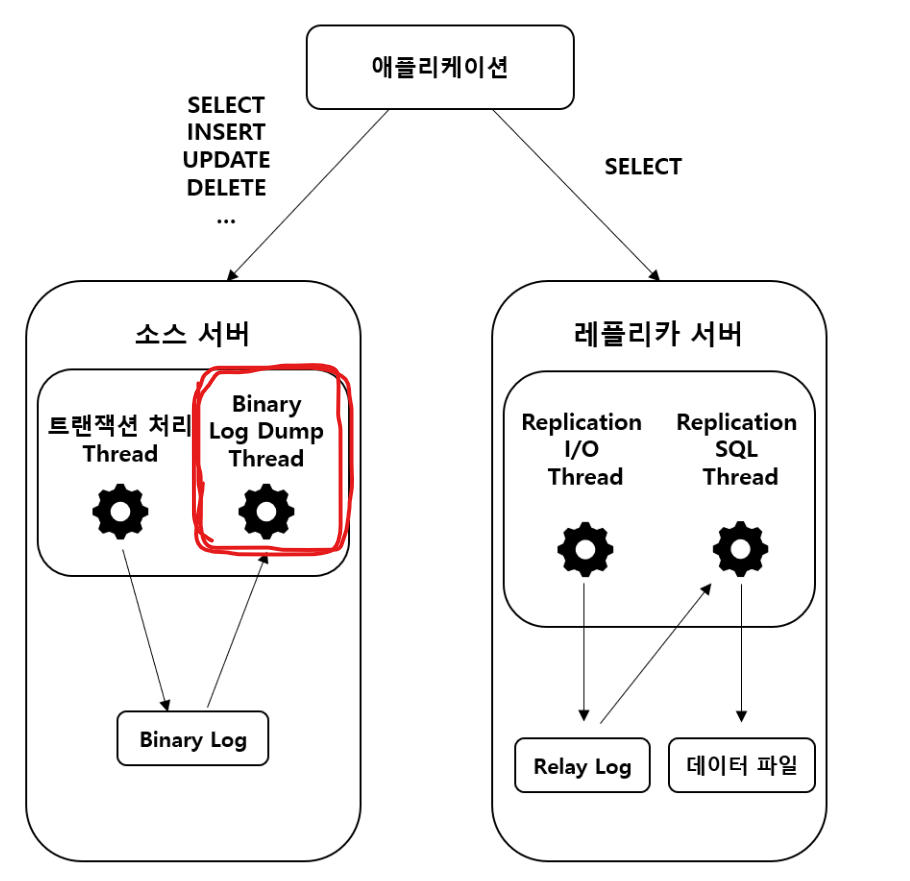
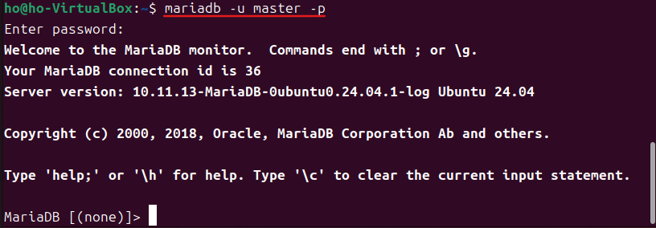
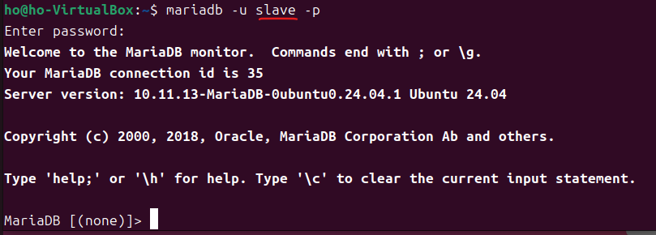
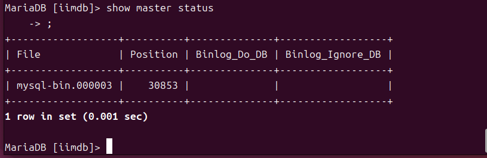
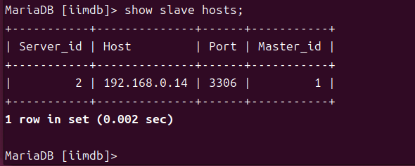
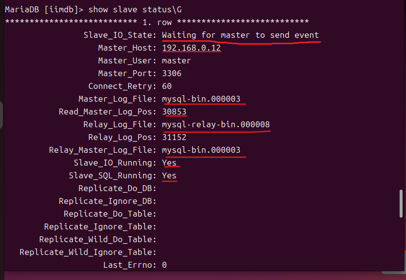
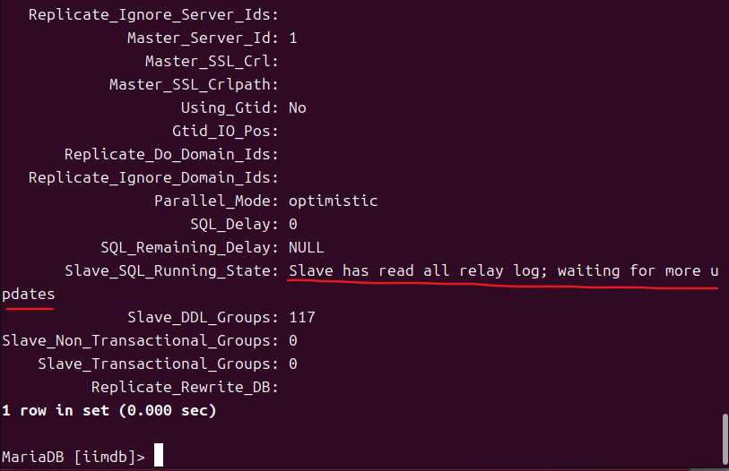
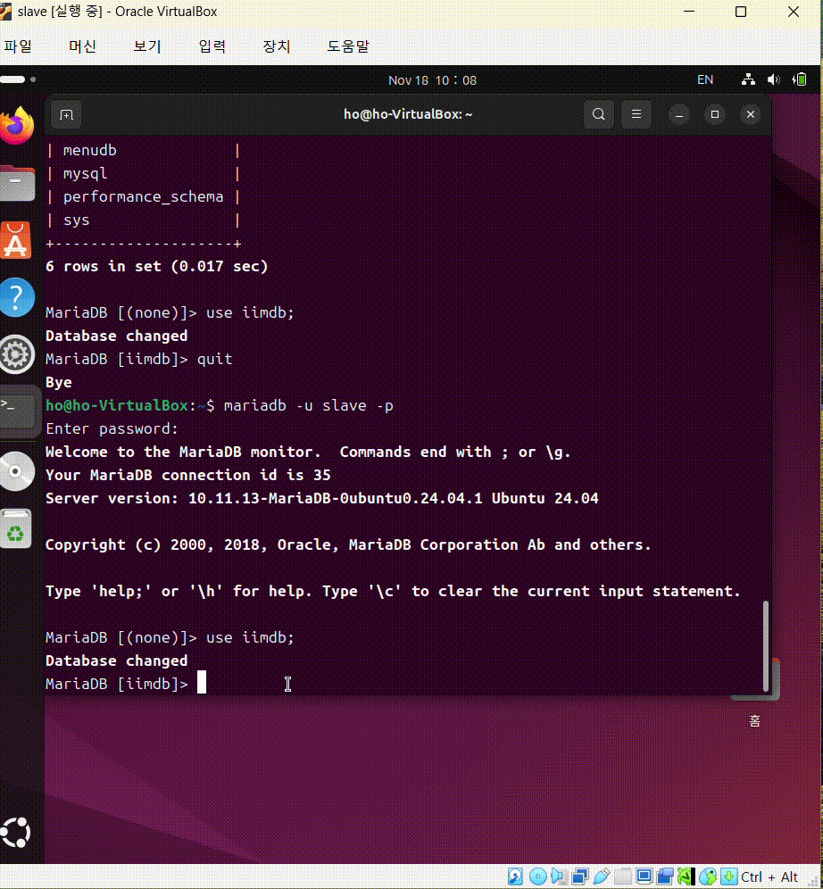
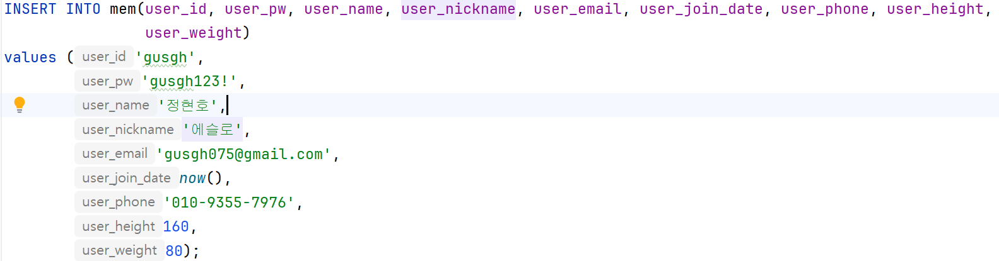

# 백업 계획
>   
>  - DB를 복제하여 2대 이상의 DBMS를 master와 slave 구조로 비동기 방식으로 데이터를 저장할 계획
    
> - 비동기 방식 : Main 흐름을 막지 않는다
    
> - 사용 프로그램
>     1. VirtualBox
>     2. Ubuntu OS
>     3. MariaDB

## backup check sequence
>1. master ubuntu에서 master계정 접속
 
>  - slave ubuntu에서 slave계정 접속
  
>2. check current user
  
>3. show status
  
  
>4. show master-slave connection
  
  
>5. master에 테이블 생성
  
>6. slave에도 테이블이 생성된 것을 확인 + test할 Mem테이블이 Empty인 것을 확인
  
  
>7. 아래 insert 구문을 master에 넣어보자
  
  